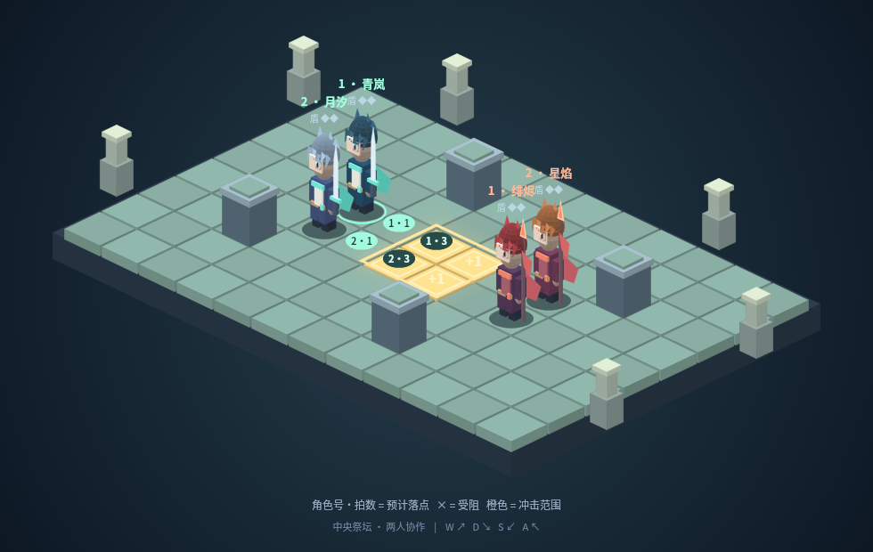

# 杨淦中｜游戏与算法作品集

一个可交互的策略游戏原型，以及三个算法应用案例。游戏部分展示规则设计与迭代；算法部分展示数据处理、模型对照、结果分析和关键点计算。

**[在线体验《三秒之间》](https://three-second-tactics.grand-lemur-8604.chatgpt.site)** · **[查看作品集 PDF](docs/杨淦中+作品集.pdf)**

## 项目一览

| 项目 | 核心内容 | 当前结果 | 项目说明与代码 |
| --- | --- | --- | --- |
| 三秒之间 | 双角色三拍规划、占点压制、护盾与有限资源改招 | 四张地图、三关互动教学；规则与界面脚本验证 | [游戏项目](projects/three-second-tactics/) |
| Walmart 周销售额预测 | 时间划分、类别编码、NumPy 梯度下降与基线比较 | 测试 R² 0.9529；未超过门店均值基线 | [回归案例](projects/walmart/) |
| 猫狗二分类 | 教师 CNN 例题改编，MLP / CNN / 增强 CNN 对照 | CNN 测试准确率 75.80%，参数量 89585 | [图像分类案例](projects/catdog/) |
| MediaPipe 关键点与距离计算 | 预训练单图推理、像素坐标与尺度转换 | 手 21 点、脸 478 点、姿态 33 点；手部距离比 1.0606 | [关键点案例](projects/mediapipe/) |

## 三秒之间：让协作产生可见的结果

玩家为两名角色分别安排三拍动作，双方同步执行，通过占领中央据点得分。敌人贴身会暂停计分，因此“站住位置”还需要队友解围。防守消耗护盾，执行中改招消耗资源；每轮是否改变计划，也成为选择的一部分。

同一局面下，两人都防守只能挡住冲击，仍然受到贴身压制；一人防守、另一人冲击，可以同时保住位置并恢复两个据点的计分。Demo 包含相应的互动场景。

[机制说明与验证记录](projects/three-second-tactics/README.md) · [游戏源码](projects/three-second-tactics/dist/) · [离线单文件版本](projects/three-second-tactics/standalone.html)

## 算法案例：保留对照与误差

- **销售预测：**按时间留出测试区间，避免随机划分混入未来记录。保留更强的门店均值基线，结合单店波动分析总体 R² 的局限。[研究报告](projects/walmart/研究报告.md) · [预测与图表](projects/walmart/results/)
- **猫狗分类：**固定训练、验证和测试划分，比较三种模型，并保留混淆矩阵与错例。普通 CNN 在本次实验中优于增强 CNN。[运行记录](projects/catdog/猫狗分类_运行记录.ipynb) · [评价结果](projects/catdog/results/summary.json) · [错例图](projects/catdog/results/figures/03_wrong_examples.png)
- **关键点计算：**从预训练模型输出中提取坐标，将指尖距离与手部参考尺度相除，得到 1.0606 的相对尺度指标。当前验证范围是静态图像。[标注结果](projects/mediapipe/results/) · [距离计算脚本](projects/mediapipe/measure_hand.py)

## 文件与来源

各项目目录包含代码、方法说明和已有实验结果。运行条件与依赖见项目 README；猫狗训练权重及 MediaPipe `.task` 模型未纳入仓库，相关恢复方式已注明。

游戏机制经过玩法讨论与迭代反馈；算法案例基于教师例题与公开数据改编。代码实现、运行验证与材料整理使用 AI 辅助，课程来源和实验记录保留。结果按已有记录展示；游戏的程序验证不等同于玩家测试。
