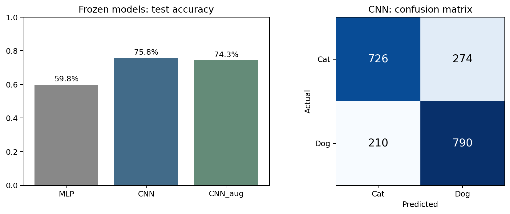

# 猫狗二分类

## 任务与方法

基于教师 CIFAR-10 卷积例题，将猫与狗筛选为二分类。12000 张 32×32 彩色图片，分为 8000 训练、2000 验证及 2000 官方测试，类别平衡。比较 MLP、CNN 与增强 CNN，按验证集最小二元交叉熵选模型，固定 0.5 分类阈值。

## 结果

| 模型 | 测试准确率 | 参数量 |
| --- | --- | --- |
| MLP | 59.80% | 393473 |
| CNN | 75.80% | 89585 |
| 增强 CNN | 74.30% | 89585 |

普通 CNN 的猫召回率 72.6%、狗召回率 79.0%。本次增强未提升结果，单次实验不足以判断其普遍效果。模型只区分猫狗，没有未知类别检测与概率校准。



[运行记录](猫狗分类_运行记录.ipynb) · [完整评价记录](results/summary.json) · [错例分析图](results/figures/03_wrong_examples.png)

## 项目输出

- [catdog_case.py](catdog_case.py)、[predict.py](predict.py)：训练、对照评价与单图推理接口。
- [猫狗分类_运行记录.ipynb](猫狗分类_运行记录.ipynb)：已有运行记录。
- [results/](results/)：固定划分、训练历史、测试预测、混淆矩阵与错例图。
- [教师 CIFAR-10 例题](../../references/cifar10_cnn_teaching_case.ipynb)：改编来源。

## 复现

```bash
python -m pip install -r requirements.txt
python catdog_case.py --output results_reproduced
python predict.py --image example_cat.png --model results_reproduced/catdog_selected.keras
```

首次训练需下载[官方 CIFAR-10 数据](https://www.cs.toronto.edu/~kriz/cifar.html)。本仓库不附训练权重，重新训练可生成权重供推理使用。代码改编、对照实现与运行验证使用 AI 辅助。
