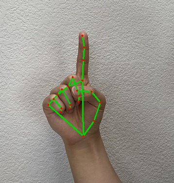

# MediaPipe 单图关键点与距离计算

## 任务与结果

基于教师示例与预训练模型，在 IMAGE 模式下验证手、脸与姿态关键点，再将归一化坐标转换为像素坐标，计算手部距离。

| 任务 | 输出 |
| --- | --- |
| 手 | 21 点 |
| 脸 | 478 点 |
| 姿态 | 33 点 |
| 全身 | 姿态 33 点，左右手各 21 点，脸未检出 |

样例拇指尖 4 到食指尖 8 的距离为 112.87 像素；腕部 0 到中指根 9 为 106.41 像素，两者相除得到 1.0606。当前验证范围为静态图像；连续帧稳定性、手势阈值与游戏控制仍属于后续方向。



[距离计算结果](results/hand_measurement.json) · [全部关键点记录](results/summary.json) · [人脸标注](results/face.jpg) · [姿态标注](results/pose.jpg)

## 项目输出

- [run_landmarks.py](run_landmarks.py)：预训练接口、结果提取与绘制。
- [measure_hand.py](measure_hand.py)：从已有 JSON 计算指尖距离与尺度比。
- [results/](results/)：标注图片、关键点 JSON 与距离记录。
- [inputs/sources.json](inputs/sources.json)、[sources/media_pipe/](sources/media_pipe/)：输入来源与教师代码。

## 复现

距离计算仅需 Pillow 与已有 JSON：

```bash
python -m pip install Pillow
python measure_hand.py
```

重新关键点推理需安装 requirements.txt，并将教师提供的 hand_landmarker.task、face_landmarker.task、pose_landmarker.task、holistic_landmarker.task 放入 sources/media_pipe/，再运行 python run_landmarks.py。模型权重不附在本仓库中；MediaPipe 使用预训练模型，本项目未训练这些模型。接口改编、距离脚本与运行验证使用 AI 辅助。
