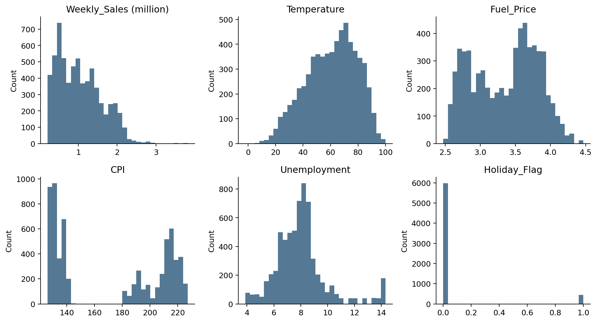
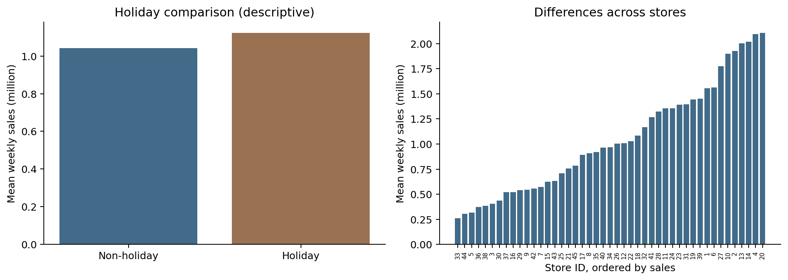
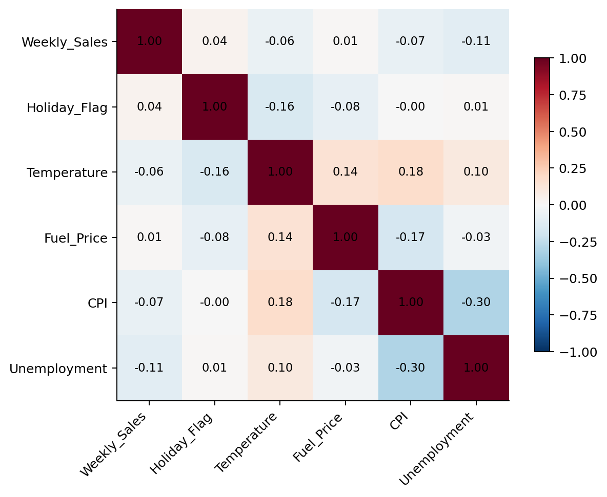
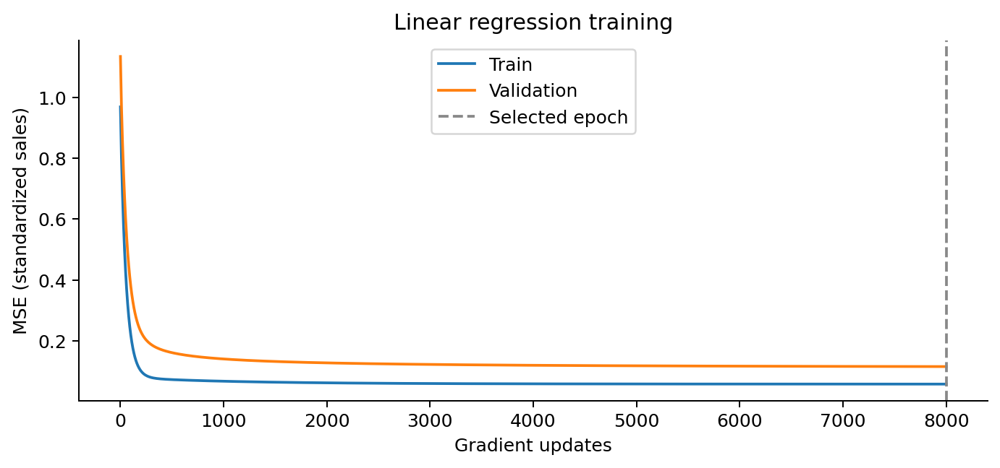
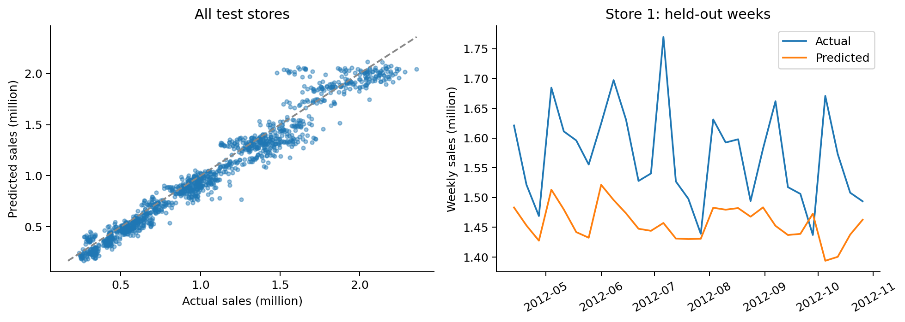
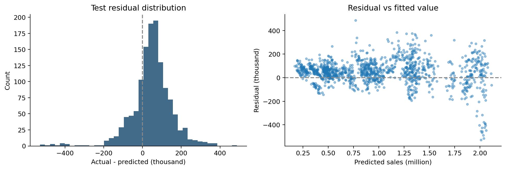
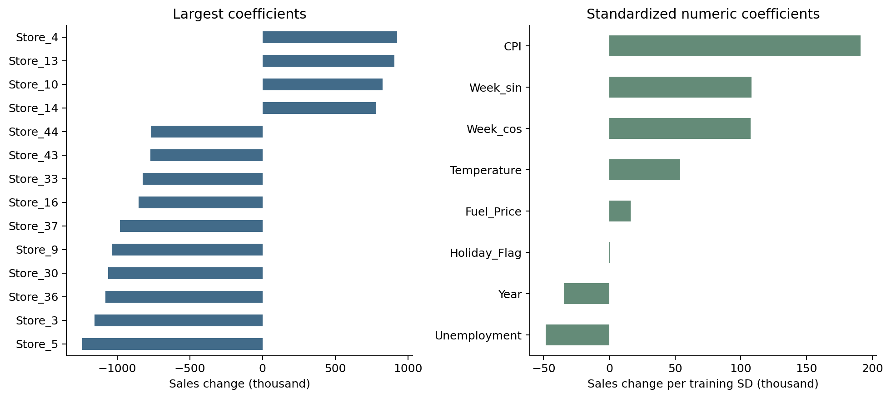

# Walmart 周销售额预测

这次用线性回归做一个基础预测：给定门店、日期、节假日和外部环境信息，估计该门店某一周的销售额。模型预测的是连续金额，因此属于回归任务。结果可以帮助判断经营规模，但用于备货前还需要检查误差是否小于简单方法。

## 1. 数据与预处理

提供的数据包含6435条记录、45家门店、143个周日期，时间从2010年2月5日至2012年10月26日。每一行表示一家门店在一周内的销售情况。金额沿用CSV原始单位。

| 字段 | 用途与处理 |
| --- | --- |
| Store | 门店编号；作为类别，不按大小解释门店差异 |
| Date | 按日-月-年解析，提取Year、Month、Week |
| Weekly_Sales | 预测目标，不进入输入特征 |
| Holiday_Flag | 节假日标记，0或1 |
| Temperature / Fuel_Price | 温度与燃油价格，数值输入 |
| CPI / Unemployment | 价格指数与失业率，数值输入 |

检查后没有缺失值、重复行或重复的门店-日期组合。销售额较大的记录保留，不能只因为它们偏离平均值就删除；节假日高峰本来就是需要预测的情况。

| 集合 | 日期范围 | 周数 | 记录数 |
| --- | --- | --- | --- |
| 训练 | 2010-02-05 至 2011-09-16 | 85 | 3825 |
| 验证 | 2011-09-23 至 2012-04-06 | 29 | 1305 |
| 测试 | 2012-04-13 至 2012-10-26 | 29 | 1305 |

按整周顺序取约60%/20%/20%，同一日期的门店不会落入不同集合。均值、标准差和独热编码只从训练集拟合，随后原样用于验证和测试。

---

## 2. 先看数据长什么样

图1 主要变量分布。Weekly_Sales图中金额以百万为单位。

销售额均值为1,046,964.88，中位数为960,746.04，最大值为3,818,686.45。均值高于中位数，右侧有少量较高销售记录；偏度为0.668，存在右偏，但并不是所有门店都围绕同一个销售水平波动。

温度和油价的分布相对连续，CPI与失业率也存在不同的取值区间。部分差异可能来自门店所在地区，因此这些变量的总体分布不等于某家门店内部的时间变化。

图2 节假日对比与门店平均销售额。这里是全数据描述性统计。

节假日周平均销售额为1,122,887.89，非节假日为1,041,256.38，前者高约7.84%。但节假日只有450条，且不同节日可能影响不同，平均差异不能直接解释成节假日的因果效果。

---

## 3. 外部因素与门店差异

图3 Pearson相关系数。Store没有进入热力图，因为编号没有连续数值含义。

销售额与温度、燃油价格、CPI和失业率的总体相关系数分别约为-0.064、0.009、-0.073、-0.106，单看总体线性关系都比较弱。节假日标记与销售额相关系数也只有0.037。弱相关不代表变量完全无用，也不能说明升温或失业率变化会直接造成相应销售变化。

不同门店的规模差异更明显。20号店平均销售额约210.77万，33号店约25.99万，两者相差约8.11倍。

## 为什么门店编号要做独热编码

直接把Store=1、2、3输入模型，会把门店编号当成有顺序、等间距的量。例如，它隐含了1号店到2号店的变化与2号店到3号店相同。这没有业务依据。独热编码给不同门店单独的截距差异，让模型先区分它们的销售规模。

月份也不是简单的越大越高。最终方案把月份作为类别，并加入周数的正弦和余弦表示季节位置，避免年末到年初在数值上突然断开。Month与周期项可能相关，后面解释权重时会保留这个限制。

---

## 4. 线性模型与训练

模型形式为 y_pred = b + Σ w_j x_j，训练目标为 MSE = Σ(y_i - y_pred_i)² / n。其中b为截距，w为特征权重。数值输入按训练集的均值和标准差进行标准化，目标销售额也按训练集统计量缩放，预测后再换回原始金额单位。

使用NumPy实现全批量梯度下降。每次更新按照MSE梯度调整权重；最多8000次更新，每10次记录一次训练和验证损失。学习率按训练设计矩阵的最大特征值确定，使这个二次优化问题的更新保持稳定。

| 预先设置的线性方案 | 验证RMSE | 验证R² |
| --- | --- | --- |
| A 门店编号直接作为数值 | 558,702.55 | 0.1468 |
| B 门店独热编码 | 220,288.49 | 0.8674 |
| C 门店、月份编码与周期项 | 190,659.03 | 0.9006 |

C方案的验证误差最小，因此选用C。权重保存轮次也依据验证MSE确定，最后保留第8000次更新。测试集没有参与标准化、特征方案选择或停止轮次选择。

图4 训练集与验证集MSE曲线。纵轴使用标准化销售额。

训练损失下降后逐渐变平，验证损失也下降，但验证误差一直高于训练误差。验证区间包含2011年末旺季，不能只按曲线间距判断模型已经过拟合。

---

## 5. 测试结果与基线比较

| 指标 | 最终线性模型 | 门店历史均值基线 |
| --- | --- | --- |
| MAE | 87,030.32 | 74,628.69 |
| MSE | 1.3399e+10 | 1.1755e+10 |
| RMSE | 115,755.26 | 108,420.29 |
| R² | 0.9529 | 0.9587 |
| WAPE（补充） | 8.39% | 7.19% |

MAE是平均偏差的绝对金额；MSE对较大误差惩罚更重，单位为金额平方；RMSE把MSE开方，回到金额单位；R²与用测试集整体均值预测作比较，越接近1代表拟合误差占总体波动的比例越小。WAPE用总绝对误差除以总实际销售额。

基线只用训练区间每家门店的历史平均销售额，测试期间保持不变。最终线性模型的R²达到0.9529，但MAE约8.70万，基线约7.46万。这个任务中，高总体R²很大程度上反映门店之间的规模差异，不能证明对每家门店下一周的波动预测得更好。

图5 测试集预测与实际值。左图覆盖全部门店，右图单独看1号店。

散点大致靠近对角线，说明门店量级可以区分。不过单家门店的峰谷仍有偏差。加入更多特征没有自动超过历史均值，模型能否用于经营判断还要看预测误差相对于业务容忍范围有多大。

---

## 6. 残差中暴露的问题

图6 测试残差分布及残差与预测值关系。残差定义为实际减预测。

测试残差均值约4.88万，整体存在低估倾向。残差并不全围绕零均匀分布，高销售门店仍会出现较大偏差。

| 门店与日期 | 实际销售 | 预测销售 | 残差 |
| --- | --- | --- | --- |
| 14号店 2012-07-27 | 1,479,514.66 | 2,008,030.71 | -528,516.05 |
| 14号店 2012-09-28 | 1,522,512.20 | 2,036,456.82 | -513,944.62 |
| 14号店 2012-07-13 | 1,544,422.35 | 2,032,782.15 | -488,359.80 |
| 17号店 2012-09-07 | 1,255,633.29 | 768,443.94 | 487,189.35 |

14号店有多条较大的负残差，说明模型在这些周高估了销售；17号店的2012年9月7日记录则出现明显低估。它们不只是随机小偏差。单一的固定门店截距不能充分表达门店自身随时间改变的经营状态。

这次没有使用前一周销售额、近期滚动均值或促销信息。模型对门店的短期涨跌缺少直接信号。如果增加这些变量，必须先按门店排序，再使用shift把当周销售从输入中排除。

各集合覆盖的季节也不完全一样：测试集为2012年4月至10月，没有年末旺季。当前测试结果不能直接外推成圣诞节期间也能达到相同水平。

---

## 7. 特征权重、局限与后续

图7 左侧展示较大权重，右侧只看数值变量。类别系数相对参照类别，数值系数对应训练集一个标准差。

门店类别权重较大，与前面看到的销售规模差异一致。数值变量中，CPI和周周期项的系数相对明显。它们表示在当前特征组合中的条件线性关联，不是变量本身对销售额的因果作用。

总体相关系数较小的CPI，在多变量模型中仍可能有较大系数。门店地区差异、月份和周期项之间的相关性，以及不足三年的数据长度，都可能使权重不稳定。因此不能把系数大小直接当成可靠的因素重要性排名。

线性回归便于复算，门店和时间特征的处理也能显著改善编号直接输入的问题。它的局限是固定加和关系较难刻画门店特有的趋势、节日尖峰和变量之间的非线性交互。

下一步更有价值的是补充过去销售的滞后量和滚动均值，再做多个时间窗口的验证；同时保留历史均值与季节基线作为对照。之后再考虑正则化或其他模型，而不是先用更复杂的网络掩盖数据处理问题。

本次温度、油价、CPI和失业率取测试数据表中记录值，因此评估的是给定这些信息的条件预测。若要提前一周真实使用，必须换成预测时刻已经可获得的环境信息或估计值。

数据与题目：课程提供Walmart_Sales.csv及《基于Walmart_Sales数据集的销售额预测建模》。数据来源按题面为Kaggle Walmart Sales（mikhail1681）。实现：NumPy梯度下降，scikit-learn负责预处理和指标。标准化参考：https://scikit-learn.org/stable/modules/generated/sklearn.preprocessing.StandardScaler.html
